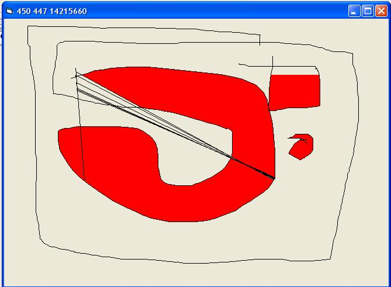



## Custom Flood Fill code \_

### Description

This code works perfectly.It is slow because i am using vb's drawing functions.Draw a line while left button is pressed and fill it with clicking the right.

I know,it is slow.
 
### More Info
 

             |
---                |---
**Submitted On**   |2005-02-18 13:15:02
**By**             |[KadmosVB](https://github.com/Planet-Source-Code/PSCIndex/blob/master/ByAuthor/kadmosvb.md)
**Level**          |Beginner
**User Rating**    |3.8 (19 globes from 5 users)
**Compatibility**  |VB 5\.0, VB 6\.0
**Category**       |[Graphics](https://github.com/Planet-Source-Code/PSCIndex/blob/master/ByCategory/graphics__1-46.md)
**World**          |[Visual Basic](https://github.com/Planet-Source-Code/PSCIndex/blob/master/ByWorld/visual-basic.md)
**Archive File**   |[Custom\_Flo1854472182005\.zip](https://github.com/Planet-Source-Code/kadmosvb-custom-flood-fill-code__1-58988/archive/master.zip)

